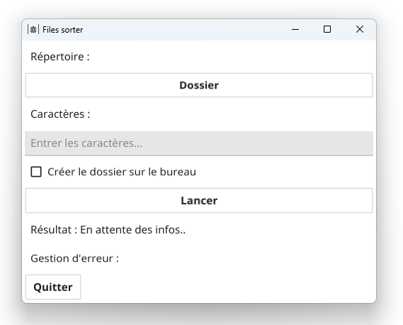
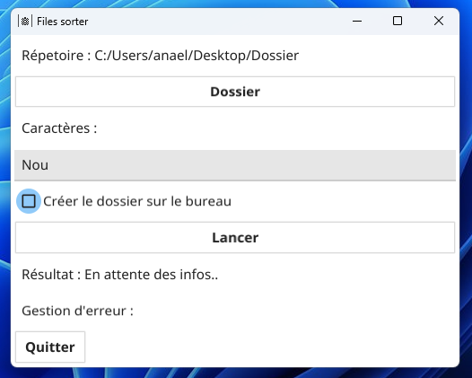
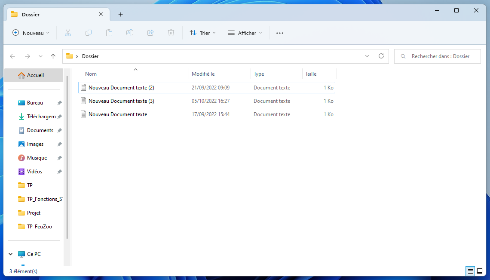

# Files-sorter

Ce logiciel vous permet de trier des dossiers remplies de fichiers.\

Il a été écrit seulement en go et possède une interface graphique faite
avec la labrairie fyne.


***

### Téléchargement :
Vous pouvez ````git clone```` le repository et lancer le logiciel avec 
```go run .```.

Sinon vous pouvez cloner le repository et faire un 
```go build SortFileInDirectory.go```. Afin d'avoir un .exe et de ne plus 
dépendre du repository.
***

### Utilisation :
Il suffit de spécifier le dossier à trier et les caractéres qui
sont similaires à tous les noms de fichier que vous voulez récupérer.

**Exemple :**
Je souhaite récupérer les fichiers qui ont dans leurs noms les 
caractères : *"Nou"* et qui sont situés dans le dossier : 
*"C:\Users\anael\Desktop\Dossier"*

Voici le logiciel une fois les infos entrés :


Voici le dossier en question :

***

